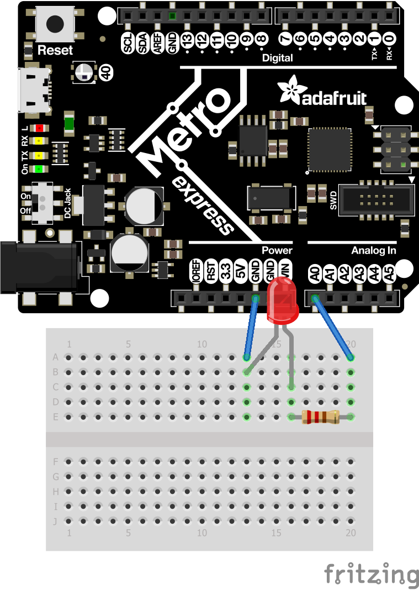

# CircuitPython
My CircutPython assignments

# Assignments-
## LED Fade
The purpose of this assignment was to get the neopixel on the metro using the new software of Circuit Python. (You can also use this code for just making a regualr LED fade, which is what the diagram is showing below) The code for this assignment is called led.fade, and can be found above. In this assignment I learned that not everything is as easy as it looks. I also learned how to use a while True loop.   

## Circuit Python Servo
The purpose of this assignment was to have the servo move one way when you touched on of the wires to a particular angle, and move the other way when you would touch the other wire depending on a certain angle. In this assignment I learned how to use a duty cycle and frequency. In short, a duty cycle determines how long a pulse stays high. Frequency is how often that pulse occurs. The code for this assignment can be found above, and is called servo.touch.control

## Circuit Python LCD
This assignment had a couple of parts. 
For part A - Turn on the LCD screen and have a button. On the LCD screen have the number of times you have pressed the button and the way the counter is counting 
For part B - Add a switch so that when you change the direction of the switch, the counting switches from up to down or from down to up. The code for this assignment is broken into two parts above. Part A is LCD.with.button and Part B is named LCD.button.and.switch. In this assignment I learned how to set up a "boolean" using Circuit Python, and how to apply it to the code in orde to have the code execute what I wanted it to. 

## Circuit Python Photointerrupter
The purpose of this assignment was to have a photointerrupter that when it was interrupted, would have the serial monitor print how many times it has been interrupted, and to have it check how many seconds have passed since it was last interrupted. The goal was for the program to check for the time every four seconds. This code can be found above under the name photointerrupter. In this assignment In this assignment I learned how to logically approach a challenge, and how to smartly name your variables so that you don't confuse yourself. I also learned how to use multiple variables and base them off of each other. 
 

## Circuit Python Distance Sensor
The purpose of this assignment was to have the neopixel on the Metro fade from red to blue to green depending on how far or close something is from the distance sensor. This code can be found above under the name distance.sensor. There is code called webstie.distance.sensor above too, but I found this one online and didnt actually get the chance to test it, so I'm not 100% sure if it works or not. In this assignment I learned that you can have the serial monitor print "out of range" so that it doesn't throw any errors at you. Simply comment out this line if you'd like to see errors. 

## Classes, Object, and Modules
The purpose of this assingment was to teach us hwo to make our lives easier with the help of modules. A module is a seperate file that you can call at different lines of code. To see a more detailed explination, see the comments in the code for this assingment (found above) classes.objects.and.modules.
In this assignment I learned how to make a module, and call it from my main code. The fritzing for this assingment and the following one (Fancy LED) are the same. However in this assignment I used tricolor LEDs, and mixed and match the primary colors to get some of the other colors. 

## Fancy LED
The purpose of this assignment was to teach us how to code the classes, objects, and modules assignment in VS code and then upload it to github. The code for this assigment can be found above under the name twofancy, while its module can be found under the name fancyLED. In this assignment I learned how to code for an assignment in VS code and then upload it to github. 

